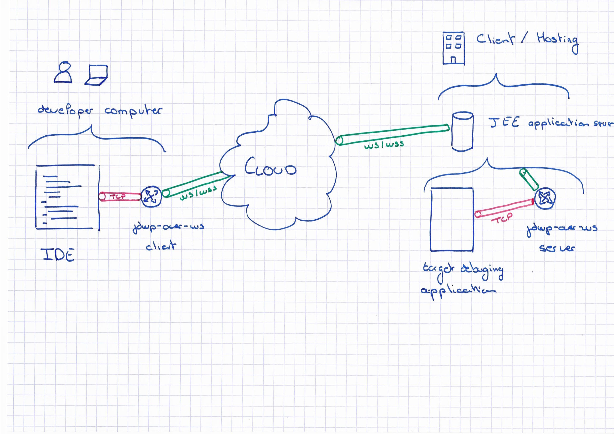

# JDWP over Web Socket 

[](https://travis-ci.org/famaridon/jdwp-over-ws)

JDWP over Web Socket aim to help Java developer debugging on cloud environment. No need to open debugging port you can use the HTTP or HTTPS port.

## Prerequisites

* Enable web socket on revers proxies  
* JDWP compatible debugger like Intellij/Eclipse/Netbeans

## Downloads

https://github.com/famaridon/jdwp-over-ws/releases

## How dose it works?

All debug tcp traffic is forwarded over web socket.

### Debug JEE (Wildfly, JBoss, ... )

#### How dose it works

This is the best use case. The jdwp-over-ws server get web socket **ws://** or **wss://** on the current **http://** or **https://** listening port.
You don't need to open new port or run an other process.




#### Installation

Simply add the jdwp-over-ws.war to your JEE server.

#### Configuration

You must set environment variable 

* **DEBUG_PORT** (mandatory): set the port to debug
* **DEBUG_TOKEN** : set the debug token. If not set one is generated and logged as INFO level

## Client usage

Display help :

```bash
java -jar jdwp-over-ws-client-<version>-shaded.jar -h

usage: cli
    --disable-reconnect   if connexion fail will not wait for new
                          connection
 -h,--help                print the help
 -p,--port <arg>          the local listening port
 -r,--remote <arg>        the remote web service url
 -t,--token <arg>         the generated server token
```

Sample usage :

```bash
java -jar jdwp-over-ws-client-<version>-shaded.jar -p 9999 -r ws://localhost:8080/tcp-over-ws/ws/tunnel -t <token> 
```

## Roadmap

https://github.com/famaridon/jdwp-over-ws/milestones


## Developer guide

### Build 

```mvn clean install```

### Code style

This project use the [Google style guide](https://github.com/google/styleguide).

You can install this code style as describe https://github.com/HPI-Information-Systems/Metanome/wiki/Installing-the-google-styleguide-settings-in-intellij-and-eclipse 
